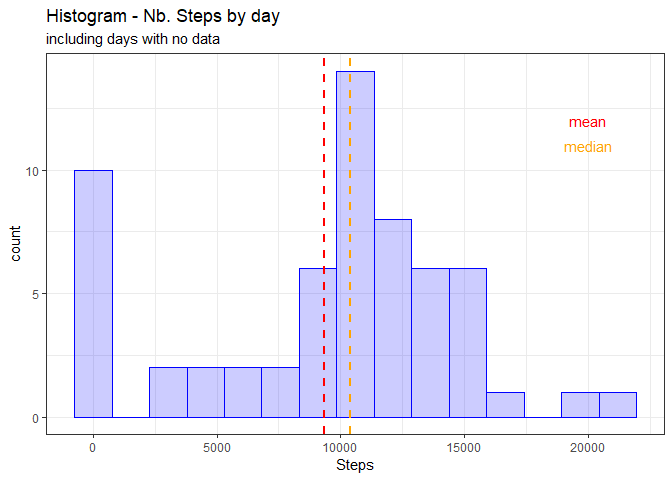
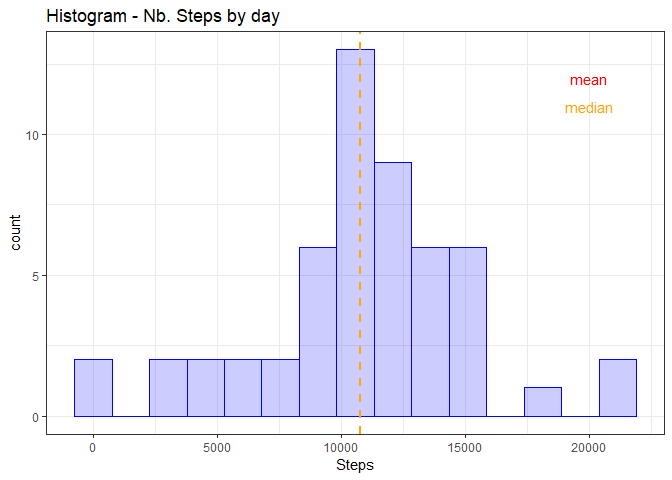
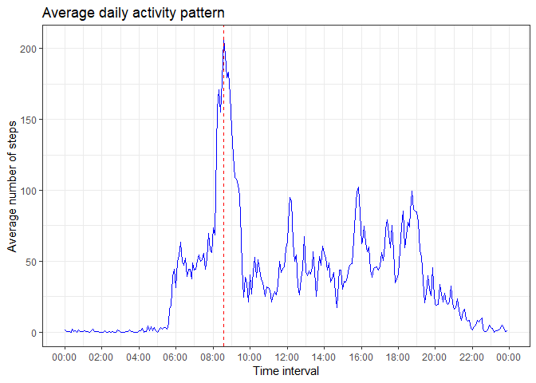
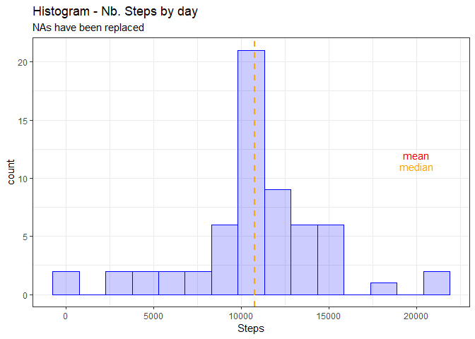
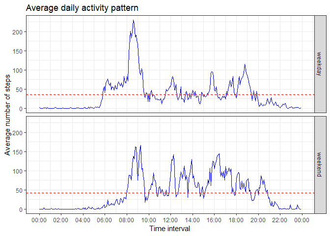

</br>
</br>
This is the Project one of the Reproducible Research course.

## Loading and preprocessing the data
</br>

####Environment

We will use the `dplyr`, `ggplot2`, `readr` and `lubridate` libraries for this assignment.


```r
library(dplyr, warn.conflicts = FALSE)
library(ggplot2)
library(readr)  # read_csv : returns a tibble
library(lubridate, warn.conflicts = FALSE)  # interval column to datetime
library(scales, warn.conflicts = FALSE) # for ggplot2 : time period 
```

The configuration is:


```
## [1] "R version :  3.4.4"
```

```
## [1] "dplyr package :  0.7.6"
```

```
## [1] "ggplot2 package :  3.0.0"
```

```
## [1] "readr package :  1.1.1"
```

```
## [1] "lubridate package :  1.7.4"
```

```
## [1] "scales package :  1.0.0"
```

  
  
####Loading the dataset

> Load the data (i.e. \color{red}{\verb|read.csv()|}read.csv())  
> Process/transform the data (if necessary) into a format suitable for your analysis


We load the data using `readr` package. We specified the expected column type and the NA value.  
We add a new column `intervaltime` to store the interval as POSIXct.  


```r
# Load the file
activity <- read_csv('activity.csv',
                col_names=TRUE,
                col_types = list(
                    col_integer(),
                    col_date(format="%Y-%m-%d"), 
                    col_integer()),
                na = "NA")

# add a new POSIXct column
activity$intervaltime <- as.POSIXct(paste(activity$interval %/% 100, 
                                          activity$interval %% 100, 
                                          "00", 
                                          sep=":"),
                            format="%H:%M:%S")

print(dim(activity))
```

```
## [1] 17568     4
```

```r
# show the first rows
head(activity)
```

```
## # A tibble: 6 x 4
##   steps date       interval intervaltime       
##   <int> <date>        <int> <dttm>             
## 1    NA 2012-10-01        0 2018-10-26 00:00:00
## 2    NA 2012-10-01        5 2018-10-26 00:05:00
## 3    NA 2012-10-01       10 2018-10-26 00:10:00
## 4    NA 2012-10-01       15 2018-10-26 00:15:00
## 5    NA 2012-10-01       20 2018-10-26 00:20:00
## 6    NA 2012-10-01       25 2018-10-26 00:25:00
```

The dataset has **17568** observations of **4** variables.  
There are **61** different days, **288** time intervals.
</br>
</br>

## What is mean total number of steps taken per day?

> Calculate the total number of steps taken per day  
> Make a histogram of the total number of steps taken each day

</br>
If we do not care about NAs (we just sum all valid digits).


```r
stepsbydaynas <- activity %>% 
    group_by(date) %>% 
    summarize(steps = sum(steps, na.rm = TRUE))
```

We have **61** rows (1 for each unique day). 


```r
ggplot(data=stepsbydaynas, aes(x=steps)) + 
    geom_histogram(bins = 15, 
                   col="blue",
                   fill="blue",
                   alpha = .2) +
    theme_bw() +
    labs(
        x = 'Steps',
        title = 'Histogram - Nb. Steps by day',
        subtitle='including days with no data') +
    geom_vline(aes(xintercept=mean(steps)),
               color="red", linetype="dashed", size=1) +
    geom_vline(aes(xintercept=median(steps)),
               color="orange", linetype="dashed", size=1) +
    annotate("text", x = 20000, y = 12, label = "mean", color="red") +
    annotate("text", x = 20000, y = 11, label = "median", color="orange")
```

<!-- -->

We see a pike around the 0 value. **8** days have 0 steps.

</br>

####Removing the days without data

To compute the average / median, we remove the days without data.


```r
stepsbyday <- activity %>% 
    filter(!is.na(steps)) %>% 
    group_by(date) %>% 
    summarize(steps = sum(steps, na.rm = TRUE))
```

We have now only **53** rows (**8** days without data have been removed => **13.1 %**). 


```r
ggplot(data=stepsbyday, aes(x=steps)) + 
    geom_histogram(bins = 15, 
                   col="blue",
                   fill="blue",
                   alpha = .2) +
    theme_bw() +
    labs(
        x = 'Steps',
        title = 'Histogram - Nb. Steps by day' ) +
    geom_vline(aes(xintercept=mean(steps)),
               color="red", linetype="dashed", size=1) +
    geom_vline(aes(xintercept=median(steps)),
               color="orange", linetype="dashed", size=1) +
    annotate("text", x = 20000, y = 12, label = "mean", color="red") +
    annotate("text", x = 20000, y = 11, label = "median", color="orange")
```

<!-- -->
</br>

> Calculate and report the mean and median of the total number of steps taken per day

We can now compute the mean and median of the total number of steps taken per day:  


| Type | mean |  median |
| --- | --- | --- |
| *with empty days* |  *9354* | *10395* |
| **only days with values** |  **10766** | **10765** |

</br>
The presence of missing days introduced a bias into **mean** computation of the data.
</br>

## What is the average daily activity pattern?

> *Make a time series plot (i.e. type="l") of the 5-minute interval (x-axis) and the average number of steps taken, averaged across all days (y-axis)*

We compute the average daily activity. We use the `intervaltime` (POSIXct) column to group the data.  
We can not use the interval column in continuous scale to draw the graph as (0, 15, 30, 45, 100) is not a continous variable but hours.


```r
stepsbyint <- activity %>% 
    filter(!is.na(steps)) %>% 
    group_by(intervaltime) %>% 
    summarize(steps = mean(steps, na.rm = TRUE))

head(stepsbyint)
```

```
## # A tibble: 6 x 2
##   intervaltime         steps
##   <dttm>               <dbl>
## 1 2018-10-26 00:00:00 1.72  
## 2 2018-10-26 00:05:00 0.340 
## 3 2018-10-26 00:10:00 0.132 
## 4 2018-10-26 00:15:00 0.151 
## 5 2018-10-26 00:20:00 0.0755
## 6 2018-10-26 00:25:00 2.09
```


We plot a line graph.  


```r
ggplot(data=stepsbyint, aes(x=intervaltime, y=steps)) + 
  geom_line(col="blue") +
  theme_bw() +
  labs(
    x = 'Time interval',
    y = 'Average number of steps',
    title = 'Average daily activity pattern' ) + 
  scale_x_datetime(date_breaks = "2 hour", date_label = "%H:%M", timezone=NULL) +
  geom_vline(
    aes(xintercept=stepsbyint[which.max(stepsbyint$steps),]$intervaltime),
    color="red", 
    linetype="dashed", 
    size=.5)
```

<!-- -->


> *Which 5-minute interval, on average across all the days in the dataset, contains the maximum number of steps?*

  
The **08:35** interval 
contains the maximum number of steps.  
</br>

## Imputing missing values

> Calculate and report the total number of missing values in the dataset (i.e. the total number of rows with NAs)
  
| NAs | Nb of rows |  % NAs |
| :---: | :---: | :---: |
| **2304** | 17568  | 13.1% |

</br>

> Devise a strategy for filling in all of the missing values in the dataset. The strategy does not need to be sophisticated. For example, you could use the mean/median for that day, or the mean for that 5-minute interval, etc.
  
I will use the 2nd example :  replace the NA with *mean for that 5-minute interval*.
  
> Create a new dataset that is equal to the original dataset but with the missing data filled in.
  

```r
activityNoNAs <- activity %>% 
  group_by(interval) %>% 
  mutate( myintervalmean = mean(steps, na.rm = TRUE) ) %>%
  mutate(steps = ifelse(is.na(steps), myintervalmean, steps)) %>%
  ungroup() %>%
  select (-myintervalmean)

paste('Number of NAs : ', sum(is.na(activityNoNAs$steps)))
```

```
## [1] "Number of NAs :  0"
```

```r
head(activityNoNAs)
```

```
## # A tibble: 6 x 4
##    steps date       interval intervaltime       
##    <dbl> <date>        <int> <dttm>             
## 1 1.72   2012-10-01        0 2018-10-26 00:00:00
## 2 0.340  2012-10-01        5 2018-10-26 00:05:00
## 3 0.132  2012-10-01       10 2018-10-26 00:10:00
## 4 0.151  2012-10-01       15 2018-10-26 00:15:00
## 5 0.0755 2012-10-01       20 2018-10-26 00:20:00
## 6 2.09   2012-10-01       25 2018-10-26 00:25:00
```

  

> Make a histogram of the total number of steps taken each day and Calculate and report the mean and median total number of steps taken per day. Do these values differ from the estimates from the first part of the assignment? What is the impact of imputing missing data on the estimates of the total daily number of steps?


```r
stepsbydayreplaced <- activityNoNAs %>% 
    group_by(date) %>% 
    summarize(steps = sum(steps, na.rm = TRUE))

ggplot(data=stepsbydayreplaced, aes(x=steps)) + 
    geom_histogram(bins = 15, 
                   col="blue",
                   fill="blue",
                   alpha = .2) +
    theme_bw() +
    labs(
        x = 'Steps',
        title = 'Histogram - Nb. Steps by day',
        subtitle='NAs have been replaced') +
    geom_vline(aes(xintercept=mean(steps)),
               color="red", linetype="dashed", size=1) +
    geom_vline(aes(xintercept=median(steps)),
               color="orange", linetype="dashed", size=1) +
    annotate("text", x = 20000, y = 12, label = "mean", color="red") +
    annotate("text", x = 20000, y = 11, label = "median", color="orange")
```

<!-- -->
  
We can see that the days with no data have been "added" to the medium bar count.
  
| Type | mean |  median |
| --- | --- | --- |
| *with empty days* |  *9354* | *10395* |
| only days with values |  10766 | 10765 |
| **NAs have been replaced** |  **10766** | **10766** |
  
The main difference is on the mean value (case 1 vs. 3): **1412** steps  
</br>
  
## Are there differences in activity patterns between weekdays and weekends?
  
> For this part the weekdays() function may be of some help here. Use the dataset with the filled-in missing values for this part.  
  
To avoid code issue, set the R current time locale to English.  
  

```r
oldlocale <- Sys.getlocale("LC_TIME")
Sys.setlocale("LC_TIME", "English")
```

```
## [1] "English_United States.1252"
```
  
  
> Create a new factor variable in the dataset with two levels - "weekday" and "weekend" indicating whether a given date is a weekday or weekend day. 
  

```r
activityNoNAs$isweekday <- factor(ifelse(weekdays(activity$date) %in% c("Saturday", "Sunday"), "weekend", "weekday"))

table(activityNoNAs$isweekday )
```

```
## 
## weekday weekend 
##   12960    4608
```


>Make a panel plot containing a time series plot (i.e. type="l") of the 5-minute interval (x-axis) and the average number of steps taken, averaged across all weekday days or weekend days (y-axis).  
  

```r
stepsbyintNoNAs <- activityNoNAs %>% 
  group_by(intervaltime, isweekday) %>% 
  summarize(steps = mean(steps, na.rm = TRUE))

stepsbyintNoNAsglobal <- activityNoNAs %>% 
  group_by(isweekday) %>% 
  summarize(stepsmean = mean(steps, na.rm = TRUE),
            foraday = round(stepsmean * 288, digit=0))

head(stepsbyintNoNAsglobal)
```

```
## # A tibble: 2 x 3
##   isweekday stepsmean foraday
##   <fct>         <dbl>   <dbl>
## 1 weekday        35.6   10256
## 2 weekend        42.4   12202
```


Build the plots.


```r
ggplot(data=stepsbyintNoNAs, aes(x=intervaltime, y=steps)) + 
  geom_line(col="blue") +
  theme_bw() +
  facet_grid(isweekday~.) +
  labs(
    x = 'Time interval',
    y = 'Average number of steps',
    title = 'Average daily activity pattern' ) + 
  scale_x_datetime(date_breaks = "2 hour", date_label = "%H:%M", timezone=NULL) +
  geom_hline(data = stepsbyintNoNAsglobal, 
             aes(yintercept = stepsmean),
             color="red", 
             linetype="dashed", 
             size=.5)
```

<!-- -->
  
Restore the locale  
  

```r
Sys.setlocale("LC_TIME", oldlocale)
```

```
## [1] "French_France.1252"
```
